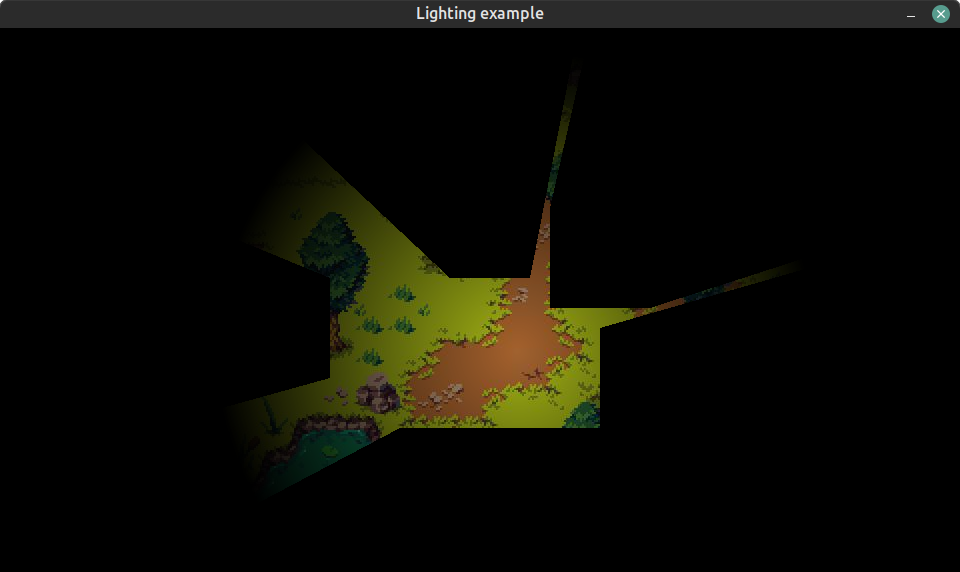

# 2D FOV and Lighting

Basic implementation of 2D field of view system with basic spotlights.
Note that this is not optimized in any way and should be considered more as a proof of concept and for fun.

## Controls
+ R to toggle visibiliy of rays
+ I to toggle visibility of intersections
+ L to toggle visibility of spotlights
+ F to toggle visibility of FOV
+ W to toggle visibility of walls
+ B to toggle visibility of boxes
+ Arrow Key Up to increase number of additional rays
+ Arrow Key Down to decrease number of additional rays

## How does it work?
I mainly followed tips from this site https://ncase.me/sight-and-light/.  
At the basic level I cast ray at every corner of a wall and then two additional rays
offset by some low angle. This is explained well in the link mentioned above.
I collect every intersection with a wall and then sort them by angle relative to the centre of the light.
After that I create trinagles from sorted intersections and apply alpha to the corners based by the distance from the centre.

### Lightning
In SDL lighting is achieved by first rendering to the background texture layer with SDL_BlendMode set to SDL_BLENDMODE_BLEND boxes and rendering image, boxes and walls. Then by creating a new texture with SDL_BlendMode set to SDL_BLENDMODE_MOD and rendering spotlights and FOV with black background. Combining these two textures to new texture with SDL_BlendMode set to SDL_BLENDMODE_BLEND gives the desired effect.  
Note that there are probably more ways to achieve better lighting effect but this is what I found.

### Example

